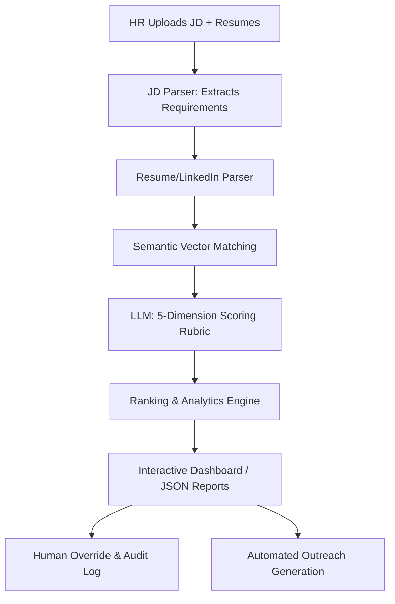

# ✨ AI-Powered HR Resume & LinkedIn Shortlisting Agent

<div align="center">
  
  
  
  
</div>

<br>

> **An enterprise-grade applicant tracking prototype** that ingests Job Descriptions, parses PDF/DOCX resumes and LinkedIn profiles, and scores candidates across 5 weighted dimensions using LLM reasoning and semantic vector matching. Features a stunning "Light Luxury" UI with human-in-the-loop override capabilities.

---

## 🎯 The Business Problem

HR teams routinely screen hundreds of applications per role, leading to fatigue, inconsistency, and unconscious bias. 

This AI agent **standardizes evaluation, highlights skill gaps, and surfaces the best-fit candidates in seconds** — all while keeping a human in the loop for final, transparent decisions.

---

## 🚀 Key Features

*   📄 **Intelligent JD Parser** — Extracts structured requirements (skills, experience, education) from free-text Job Descriptions.
*   📂 **Multi-Format Ingestion** — Flawlessly parses PDF, DOCX, TXT resumes, and LinkedIn profile JSON/URLs into structured profiles.
*   🧠 **Hybrid Semantic Matching** — Combines local embedding similarity (TF-IDF/sentence-transformers) with deep LLM reasoning.
*   📊 **5-Dimension Scoring Rubric** — Transparent, weighted scoring (Skills 30%, Experience 25%, Education 15%, Projects 20%, Communication 10%).
*   🏆 **Versus Matchup Mode** — Side-by-side radar chart comparisons between top candidates.
*   ✏️ **Human-in-the-Loop Hook** — Complete audit trail allowing HR to override AI scores with mandatory justifications.
*   ✉️ **Automated Outreach** — One-click generation of personalized "Hire" or "No-Hire" emails based on the AI's specific scoring justifications.
*   🛡️ **Enterprise Security** — Real-time PII masking, prompt injection detection, and blind-hiring toggle.

---

## 🏗️ System Architecture



---

## 📊 The Scoring Rubric

Our strict, deterministic scoring rubric guarantees consistent candidate evaluation:

| Dimension | Weight | 0 = Poor | 5 = Average | 10 = Excellent |
| :--- | :---: | :--- | :--- | :--- |
| **Skills Match** | 30% | < 30% match | 50–70% match | > 85% match |
| **Experience Relevance** | 25% | Unrelated domain | Adjacent domain | Exact domain + seniority |
| **Education & Certs** | 15% | Below minimum | Meets minimum | Exceeds + certifications |
| **Project / Portfolio** | 20% | No evidence | 1–2 generic | Strong relevant portfolio |
| **Communication Quality** | 10% | Poor structure | Adequate | Crisp, structured, impactful |

---

## 💻 Quick Start Guide

### 1. Clone & Setup
```bash
git clone <your-repo-url>
cd HR-Resume-Shortlisting-Agent
python -m venv venv
source venv/bin/activate  # Windows: venv\Scripts\activate
pip install -r requirements.txt
```

### 2. Configure Environment
```bash
cp .env.example .env
# Edit .env and add your GROQ_API_KEY (Get one free at https://console.groq.com/keys)
```

### 3. Launch the Dashboard
```bash
streamlit run app.py
```
*The app will launch locally on `http://localhost:8501`. Navigate to the "Input & Analysis" tab to load the demo JD and upload resumes.*

---

## 🛡️ Security & Risk Mitigation (Mandatory Disclosure)

Security is treated as a first-class citizen in this pipeline. See [SECURITY.md](docs/SECURITY.md) for deeper implementation details.

| Risk Category | Mitigation Strategy Implemented |
| :--- | :--- |
| **Prompt Injection** | Input sanitization, constrained JSON schemas, and output parsing validation. |
| **Data Privacy / PII** | Pre-processing `mask_pii()` redacts emails/phones before sending data to the cloud LLM. Local embedding processing. |
| **API Key Exposure** | Environment variables (`.env`) via `python-dotenv`. `.env` excluded via `.gitignore`. |
| **Hallucination Risk** | JSON mode enforcement, clamped 0-10 scoring, required justifications, and Human-in-the-Loop overrides. |
| **Email Spoofing** | "Dry-run" implementation drafts emails to the UI but prevents automated SMTP dispatch without human review. |

---

## 🔧 Technical Stack & Decision Log (Mandatory Disclosure)

For a comprehensive breakdown, please read our [TECHNICAL_DISCLOSURE.md](docs/TECHNICAL_DISCLOSURE.md).

| Component | Choice | Rationale |
| :--- | :--- | :--- |
| **LLM Engine** | `Groq LLaMA-3.3-70b-versatile` | Chosen for its blazing-fast inference speeds (LPU), which is critical when analyzing dozens of resumes synchronously. Provides GPT-4 class reasoning for structured JSON extraction at a fraction of the cost. |
| **Agent Framework** | `Custom Python Orchestrator` | Instead of bloated wrappers (LangChain/CrewAI), we built a lightweight, deterministic pipeline. This ensures strict execution order without infinite loops, saving API costs and ensuring high reliability. |
| **Prompt Design** | `Zero-Shot JSON Constrained` | Explicit JSON schema mapping to the 5 rubric dimensions, with strict guardrails stripping markdown and clamping scores. Semantic match data is injected into the prompt to ground the LLM's reasoning. |
| **Vector Engine** | `scikit-learn TF-IDF` | Provides blazing-fast local keyword-semantic matching without network latency or external API dependencies. |
| **UI/UX** | `Streamlit + Custom CSS` | Rapid interactive dashboarding combined with a custom "Light Luxury" CSS theme featuring responsive flex-boxes, edge-to-edge layouts, and Altair radar charts. |

---

<div align="center">
  <p>Built with ❤️ for Modern HR Teams</p>
  <p><i>MIT License — See LICENSE for details.</i></p>
</div>
